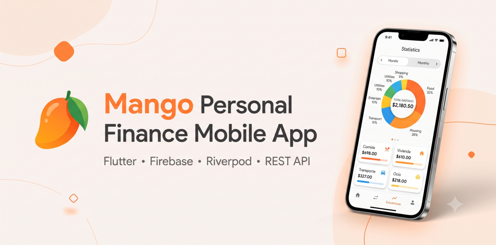
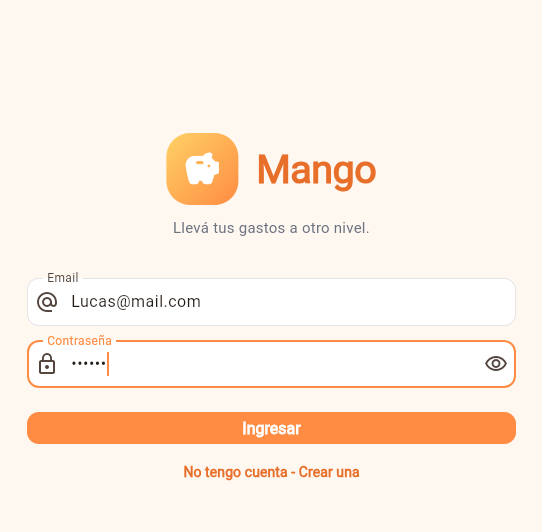
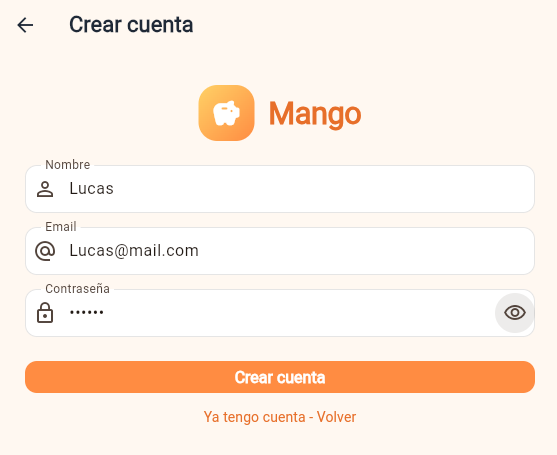
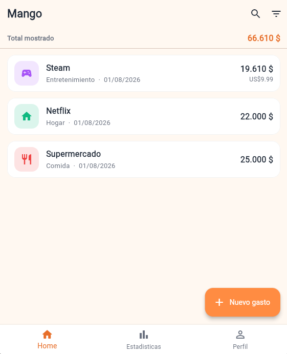
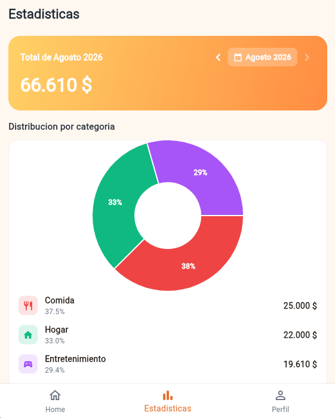
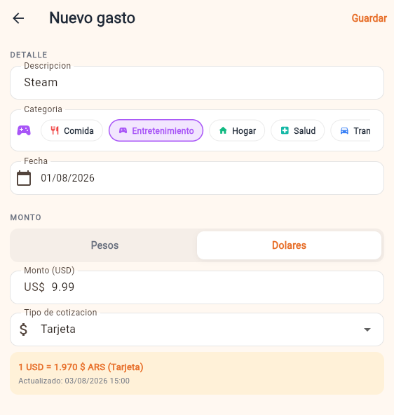
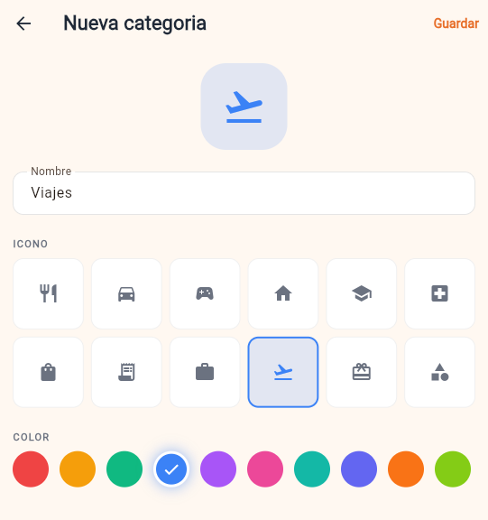

<p align="center">
  
</p>

<h1 align="center">🥭 Mango</h1>

<p align="center">
  Personal Finance Mobile App built with Flutter
</p>

<p align="center">
  
  
  
  
  
  
</p>

---

# 📱 About

**Mango** is a cross-platform personal finance application built with **Flutter** that helps users track expenses, organize categories and visualize spending through a clean and intuitive interface.

The application integrates **Firebase Authentication**, **Cloud Firestore** and **REST APIs**, following a **layered architecture** focused on scalability, maintainability and clean code.

---

# ✨ Features

- 🔐 Secure authentication with Firebase
- 💸 Create, edit and delete expenses
- 🗂️ Category management
- 💱 Multi-currency support (ARS / USD)
- 📈 Monthly statistics
- 📊 Interactive charts
- ☁️ Cloud Firestore integration
- 🌐 REST API consumption
- 📱 Responsive Material Design UI

---

# 📸 Screenshots

### Authentication

| Login | Register |
|-------|----------|
|  |  |

### Dashboard

| Home | Statistics |
|------|------------|
|  |  |

### Expense Management

| Add Expense | Categories |
|------------|------------|
|  |  |

---

# 🏗️ Architecture

The project follows a **Layered Architecture**, separating business rules, data access and presentation to keep the codebase clean, scalable and maintainable.

```text
Presentation
      │
      ▼
Domain
      │
      ▼
Data
      │
      ▼
Firebase / REST API
```

---

# 🛠️ Tech Stack

| Category | Technologies |
|----------|--------------|
| Mobile | Flutter, Dart |
| State Management | Riverpod |
| Navigation | go_router |
| Backend as a Service | Firebase Authentication |
| Database | Cloud Firestore |
| Networking | REST API |
| Architecture | Layered Architecture |

---

# 🚀 Getting Started

Clone the repository

```bash
git clone https://github.com/lucasleoimizcoz/mangoapp-flutter.git
```

Install dependencies

```bash
flutter pub get
```

Run the application

```bash
flutter run
```

---

# 🎯 Project Highlights

- 📱 Cross-platform mobile application
- 🏛️ Layered Architecture
- 🔐 Firebase Authentication
- ☁️ Cloud Firestore
- 📊 Interactive Statistics
- 💱 Multi-currency Support
- 🌐 REST API Integration

---

# 🚀 Future Improvements

- 🔔 Push Notifications
- 🌙 Dark Mode
- 📅 Recurring Expenses
- 📤 Export reports (PDF / Excel)
- ☁️ Cloud Backup
- 🔍 Search & Filters
- 💹 Budget planning

---

# 👨‍💻 Author

**Lucas Imizcoz**

Full Stack Developer

📧 **Email:** lucasleoimizcoz@gmail.com

💼 **LinkedIn:** https://www.linkedin.com/in/lucas-imizcoz/

---

<p align="center">
⭐ If you found this project interesting, consider giving it a star!
</p>